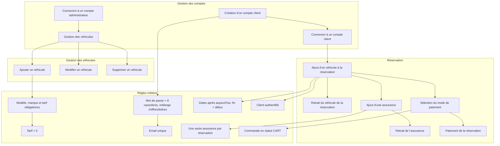

```mermaid
graph TD
    subgraph "Gestion des comptes"
        A[Connexion à un compte administrateur] --> B[Gestion des véhicules]
        C[Création d’un compte client] --> D[Connexion à un compte client]
    end

    subgraph "Gestion des véhicules"
        B --> E[Ajouter un véhicule]
        B --> F[Modifier un véhicule]
        B --> G[Supprimer un véhicule]
    end

    subgraph "Réservation"
        D --> H[Ajout d’un véhicule à la réservation]
        H --> I[Retrait du véhicule de la réservation]
        H --> J[Ajout d’une assurance]
        J --> K[Retrait de l’assurance]
        H --> L[Sélection du mode de paiement]
        L --> M[Paiement de la réservation]
    end

    subgraph "Règles métiers"
        E --> N[Modèle, marque et tarif obligatoires]
        N --> O[Tarif > 0]
        C --> P[Mot de passe > 8 caractères, mélange chiffres/lettres]
        P --> Q[Email unique]
        H --> R[Dates après aujourd’hui, fin > début]
        H --> S[Client authentifié]
        J --> T[Une seule assurance par réservation]
        L --> U[Commande en statut CART]
    end
```
